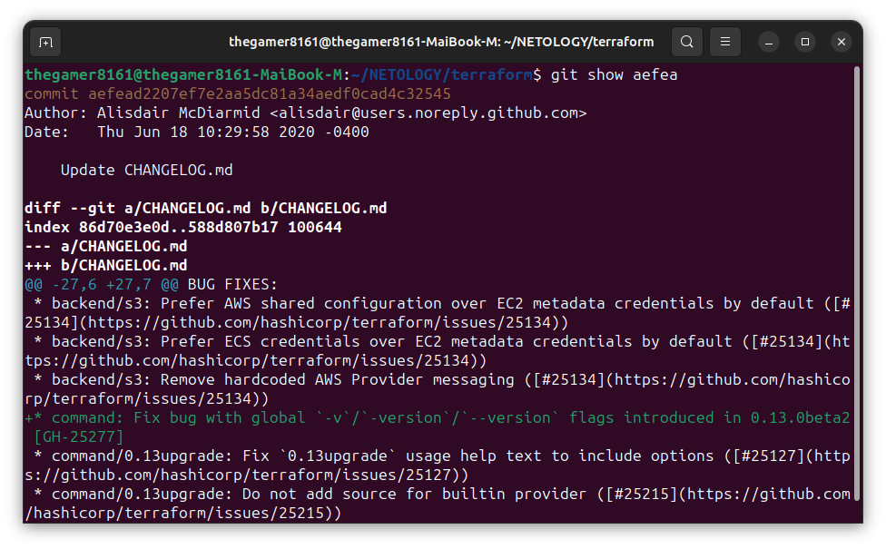
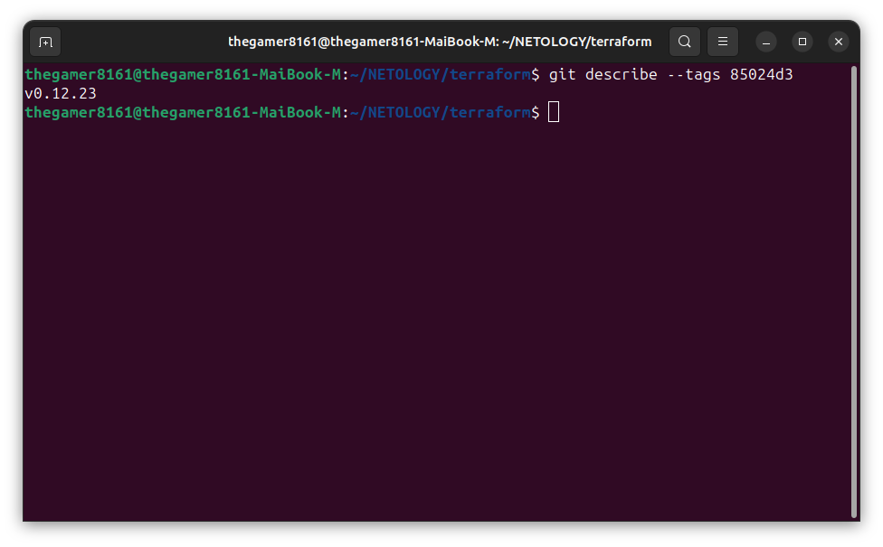
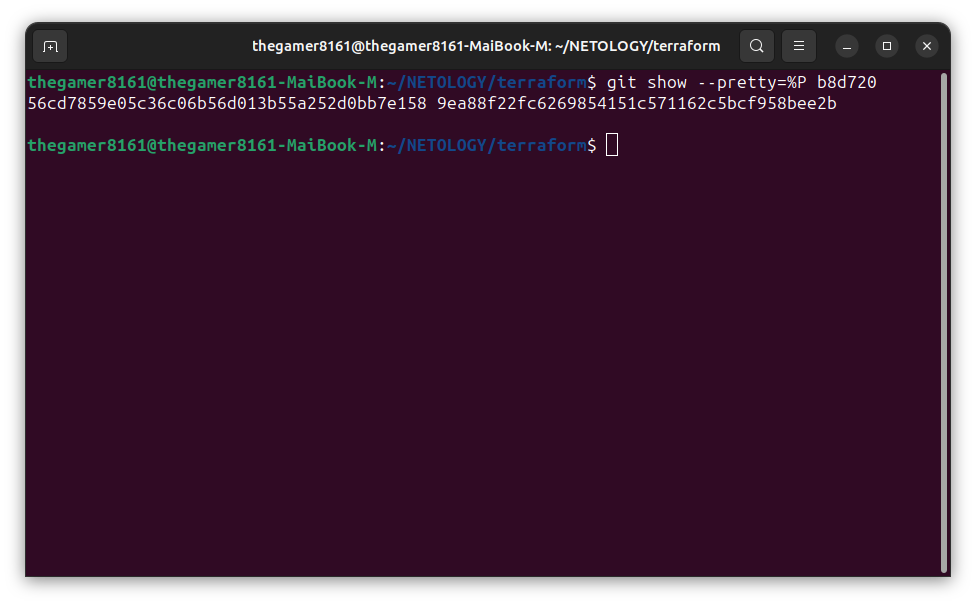
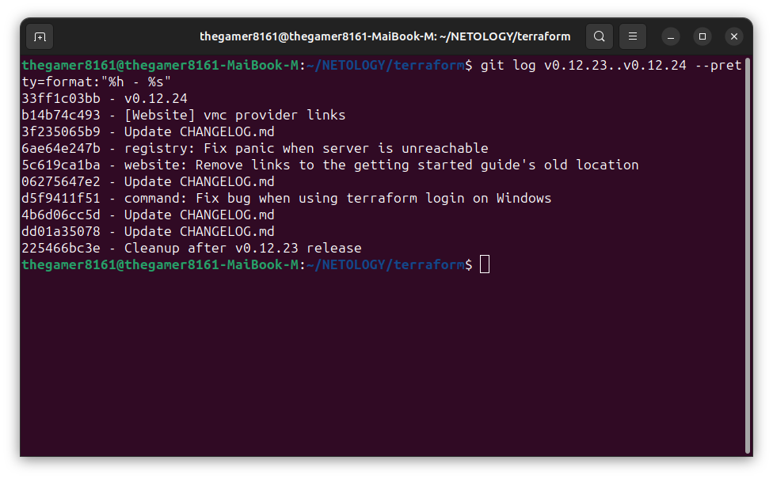
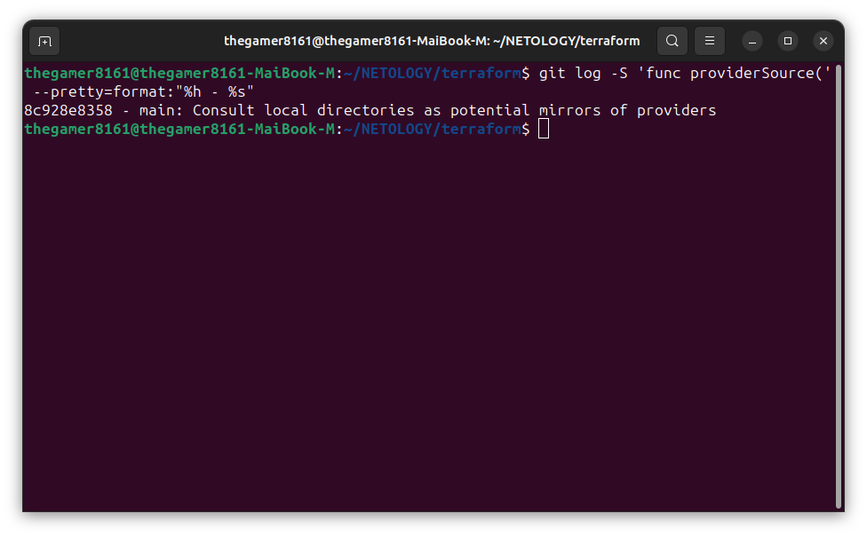
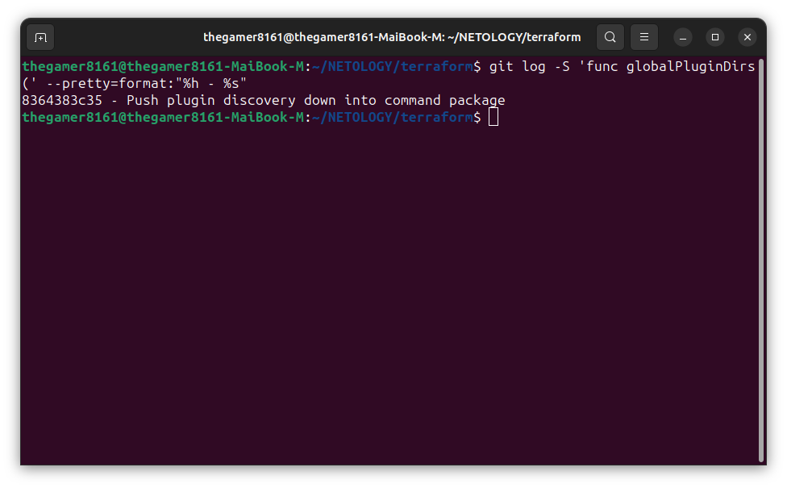
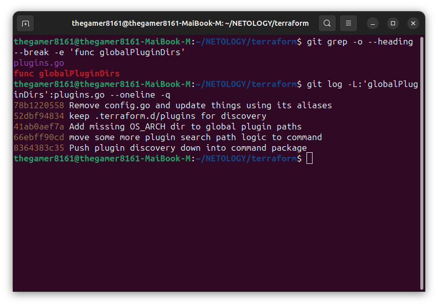
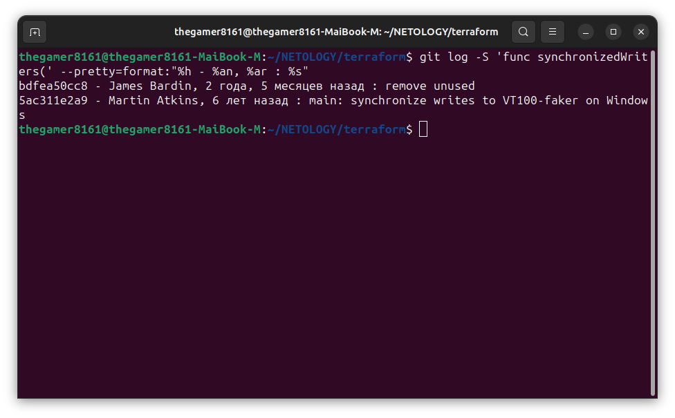

# Домашнее задание к занятию «Инструменты Git» Никоноров Денис FOPS-6

## Задание

1. Найдите полный хеш и комментарий коммита, хеш которого начинается на *aefea*.

Для поиска коммита по хешу:
```commandline
git show aefea
```

В выводе будет полный хеш коммита и его комментарий.



2. Какому тегу соответствует коммит *85024d3*?

Для поиска тега по коммиту:
```commandline
git describe --tags 85024d3
```

Тег, соответствующий коммиту *85024d3* - v0.12.23.



3. Сколько родителей у коммита *b8d720*? Напишите их хеши.

Для поиска количества родителей коммита:
```commandline
git show --pretty=%P b8d720
```

Вывод будет содержать список хешей родительских коммитов.



4. Перечислите хеши и комментарии всех коммитов, которые были сделаны между тегами v0.12.23 и v0.12.24.

Для того, чтобы перечислить хеши и комментарии всех коммитов, которые были сделаны между тегами v0.12.23 и v0.12.24:
```commandline
git log v0.12.23..v0.12.24 --pretty=format:"%h - %s"
```

Вывод будет содержать список хешей и комментариев всех коммитов, сделанных между тегами.



5. Найдите коммит, в котором была создана функция func providerSource, её определение в коде выглядит так: func providerSource(...) (вместо троеточия перечислены аргументы).

Для того, чтобы найти коммит, в котором была создана функция func providerSource, её определение в коде выглядит так: func providerSource(...):
```commandline
git log -S 'func providerSource(' --pretty=format:"%h - %s"
```

Выводом будет список коммитов, в которых функция была добавлена в код, вместе с их хешами и комментариями. Выберите нужный коммит по комментарию и хешу.



6. Найдите все коммиты, в которых была изменена функция globalPluginDirs.

Для того, чтобы найти все коммиты, в которых была изменена функция globalPluginDirs:
```commandline
git log -S 'func globalPluginDirs(' --pretty=format:"%h - %s"
```

Выводом будет список коммитов, в которых функция была изменена, вместе с их хешами и комментариями. Поиск можно сузить, указав диапазон дат или диапазон коммитов, между которыми нужно искать.



### Доработка 6 задания

Находим файл где присутствует функция globalPluginDirs

```commandline
git grep -o --heading --break -e 'func globalPluginDirs'
```

Следующим этапом найдем коммиты с изменениями функции (включая первоначальное создание)

```commandline
git log -L:'globalPluginDirs':plugins.go --oneline -q
```



7. Кто автор функции synchronizedWriters?

Для того, чтобы найти автора функции synchronizedWriters:
```commandline
git log -S 'func synchronizedWriters(' --pretty=format:"%h - %an, %ar : %s"
```

Выводом будет список коммитов, в которых функция была добавлена или изменена, вместе с их хешами, авторами, датами и комментариями.

